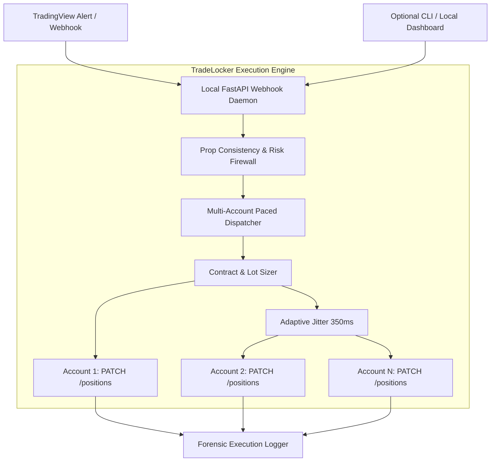

# Commercial Blueprint: TradeLocker Anti-429 Execution Bridge & Multi-Account Copier
**Classification:** Product Strategy & Monetization Playbook  
**Target Delivery:** Self-Serve Digital Utility (Zero-Sales Overhead)  
**Target Market:** Prop Firm Traders & Algorithmic Traders on TradeLocker  

---

## 1. Executive Summary & Market Thesis

Following MetaQuotes' crackdown on proprietary trading firms, thousands of US and international prop traders were forced to migrate from MT4/MT5 to modern alternative platforms, primarily **TradeLocker**. 

While MT4/MT5 enjoyed a 15-year ecosystem of mature trade copiers, EA bridges, and webhook execution listeners (e.g., Social Trader Tools, Telegram copiers), **the tooling ecosystem around TradeLocker is currently in its infancy**. Traders attempting to run multi-account fleets or execute automated TradingView alerts face critical platform bugs and infrastructure bottlenecks daily:

1. **HTTP 429 Rate Limiting:** Sending simultaneous market orders across multiple funded accounts triggers TradeLocker's strict endpoint rate limiters, leaving accounts partially filled or unhedged.
2. **The Pending Stop-Order Duplication Bug:** Submitting standard pending stop orders on TradeLocker brokers operating in hedging mode (e.g., Upcomers) does not modify an existing bracket; it posts an unattached pending order. When stopped out, the second order executes on a flat account, opening an **accidental naked reverse position** without stop losses.
3. **Prop Consistency Rule Breaches:** Most prop firms enforce strict consistency rules (e.g., no single trade or day exceeding 20%–30% of total target profit). Manual traders frequently violate these rules during volatile expansions.

### The Opportunity
By decoupling the existing, battle-tested execution layer of the Bayesian Pivot infrastructure, we can package a standalone, commercial-grade **TradeLocker Execution Bridge & Multi-Account Copier**.

---

## 2. Product Architecture & Decoupled Engine

The commercial product strips out all proprietary alpha generation, Bayesian inference models, and trading strategies. It packages strictly **the execution plumbing**:



### Core Components
1. **TradingView Webhook Listener (Local Daemon):**
   * Lightweight local FastAPI daemon listening on `http://127.0.0.1:8000/webhook`.
   * Accepts standardized JSON payloads:
     ```json
     {
       secret: USER_CONFIGURED_AUTH_KEY,
       action: BUY,
       symbol: BTCUSD,
       risk_usd: 150.0,
       sl: 63200.0,
       tp: 65400.0
     }
     ```
2. **Multi-Account Paced Dispatcher:**
   * Sequences API requests across the fleet using adaptive pacing (300ms–500ms intervals with jitter) to completely eliminate HTTP 429 / 504 errors.
   * Supports dedicated per-account proxy mapping (critical for prop firms that monitor IP concurrency).
3. **True In-Place Bracket Modification:**
   * Hardened against the Stop-Order Duplication bug.
   * Utilizes atomic `PATCH /backend-api/trade/accounts/{acc}/positions/{pos_id}` with absolute `stopLoss` and `takeProfit` values, ensuring no secondary unattached orders are spawned on the broker's book.
4. **Contract Sizing & Multiplier Normalization:**
   * Automated lot calculation normalizing across asset classes:
     * Crypto (1x contract multiplier)
     * Gold / Commodities (100x multiplier)
     * FX Pairs (100,000 contract size)
5. **Prop Firm Consistency Guardian:**
   * Pre-trade check against daily profit caps and account trailing drawdown limits before order submission.

---

## 3. The Purely Transactional "Self-Serve" Model
*(Zero Sales, Zero Calls, Minimal Support)*

This model is engineered specifically for solo technical developers who want to monetize working code **without engaging in high-friction sales calls, client pitching, or customer support hell.**

### 1. The Vending Machine Setup
* **Platform:** [Whop](https://whop.com) or [LemonSqueezy](https://lemonsqueezy.com)
  * Set up in < 1 hour.
  * Handles credit cards, Apple Pay, Stripe payouts, VAT/taxes, license key issuance, and access to private release channels.
* **Pricing Architecture:**
  * **Monthly Subscription:**  / month (recurring cash flow).
  * **Founding Member License:**  one-time (early cash generation; includes 1 year of updates).

### 2. The Distribution Action (The "One Proof-of-Work Post")
No sales funnels, ad spend, or DM spamming. Distribution relies on transparent engineering proof of work shared directly where traders are actively suffering from TradeLocker glitches.

* **Asset:** A clean 2-minute raw screen capture:
  1. Triggering an alert via TradingView.
  2. Showing the daemon ingest the webhook in real-time.
  3. Showing 5–8 TradeLocker demo accounts execute simultaneously within 1.5 seconds with exact stop losses attached, zero duplicate orders, and zero 429 timeouts.
* **Channels:**
  * Reddit: `r/PropFirms`, `r/Forex`, `r/algotrading`.
  * Twitter / X trading circles.
  * Prop firm trader communities (Upcomers, GoatFunded, FunderPro).
* **The Post Copy:**
  > *"TradeLocker currently has a critical bug where pending stop orders create duplicate naked reverse positions, and multi-account orders frequently trigger HTTP 429 rate limits. I built a Python execution bridge using in-place PATCH requests and 350ms adaptive pacing to solve this across my own funded fleet. Decoupled and packaged it as a local-first utility for anyone running multi-account TradeLocker fleets: [Link]"*

### 3. Strict Boundary & "As-Is" Positioning
To prevent customer support drain and maintain complete autonomy:
* **Self-Hosted Developer Utility:** Positioned as a local tool for traders capable of editing a `config.yaml` file.
* **Documentation-First:** A comprehensive, step-by-step `SETUP.md` guide covering credential retrieval, webhook configuration, and ngrok/Cloudflare tunnel setup.
* **Explicit Support Notice:**
  > *"This is a self-hosted developer tool provided as-is. Step-by-step setup documentation is included. No 1-on-1 onboarding or manual technical support is provided."*

---

## 4. 30-Day Execution Roadmap

| Phase | Milestone | Deliverable |
| :--- | :--- | :--- |
| **Week 1** | **Decouple Core Engine** | Extract `TradeLockerClient` and multi-account dispatch logic into a standalone repository. Implement FastAPI webhook receiver and `config.yaml`. |
| **Week 2** | **Packaging & Demo Asset** | Build single-command launcher (`run.sh` / `main.py`). Record a 2-minute proof video showing flawless multi-account execution. |
| **Week 3** | **Checkout & Infiltration** | Create Whop checkout page. Post the demonstration video to `r/PropFirms` and trader communities with link. |
| **Week 4** | **Initial Cash Flow & Verification** | Onboard first cohort of 5–10 paying users (,000–,000 gross). Monitor stability and release documentation errata. |

---

## 5. Technical Safeguards & Risk Management

1. **Local-First Security:** Users store their TradeLocker credentials, server URLs, and API tokens locally in their own environment. The seller never stores or touches user credentials, eliminating liability.
2. **Prop Firm Multi-IP Compliance:** Every account configured in `config.yaml` accepts an optional `proxy_url` (HTTP/SOCKS5), ensuring accounts are not flagged for IP concurrency.
3. **Forensic Audit Logging:** Every dispatched request logs the exact timestamp, response code, broker position ID, and payload to `logs/execution_audit.log`, giving traders definitive proof if broker-side slippage occurs.
